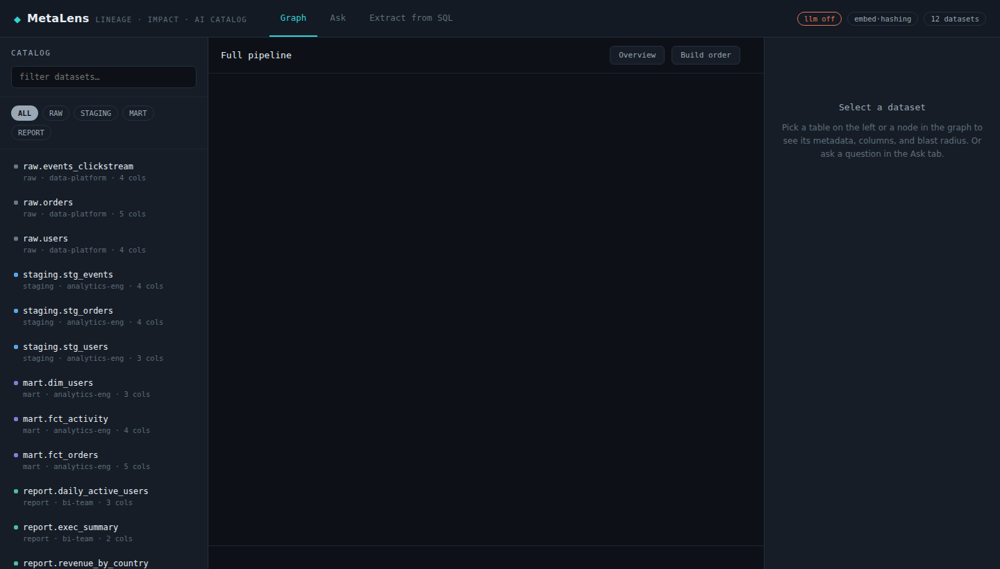
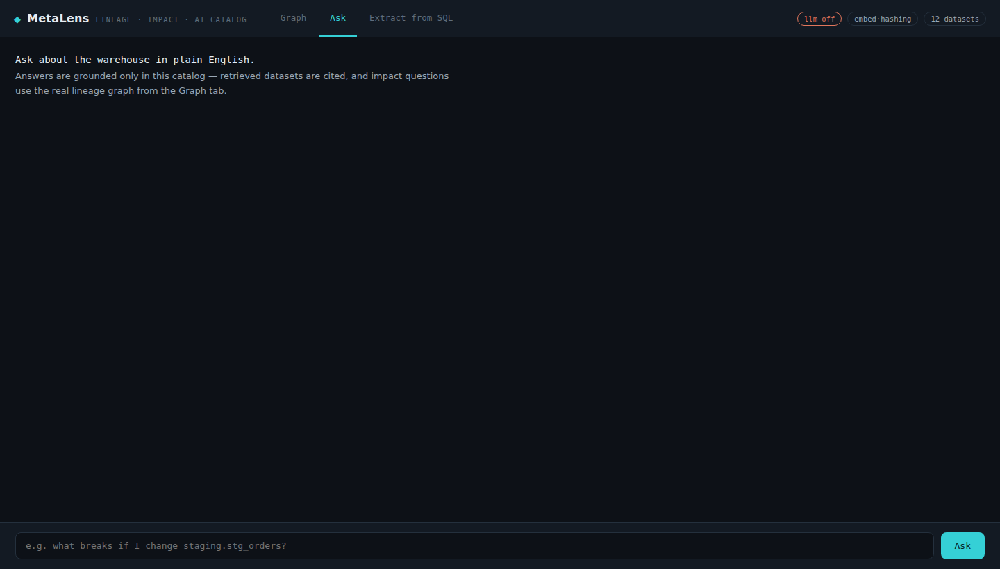

# MetaLens — data lineage, impact analysis & AI catalog

A single data-catalog tool with two sides that operate on **one shared catalog**:

- **A graph lineage engine** — model your warehouse as a directed graph and get
  interactive lineage, impact analysis ("what breaks if I change this?"),
  pipeline build order, and column-level provenance. Pure algorithms, no LLM needed.
- **AI on top of the same catalog** — extract column-level lineage from raw SQL
  with an LLM, and ask questions about the warehouse in plain English (RAG),
  grounded in the catalog with citations.

The two sides are genuinely integrated: **lineage extracted from SQL is inserted
into the same graph**, so a newly-extracted table immediately appears in the
graph view, participates in impact analysis, and shows up in AI answers.




## Three tabs, one catalog

| Tab | What it does | Powered by |
|---|---|---|
| **Graph** | Interactive lineage map, click any dataset for upstream/downstream, impact meter, build order | graph algorithms (DFS/BFS/topological sort) |
| **Ask** | Natural-language questions, grounded answers with dataset citations | RAG (embeddings + retrieval + LLM) |
| **Extract from SQL** | Paste SQL → column-level lineage inferred, optionally added to the graph | LLM + validation |

## Why this is a real project (what to look at)

The engineering worth defending, none of it a thin wrapper:

- **Graph engine** (`backend/lineage.py`, dependency-free): DFS transitive lineage,
  BFS shortest path, **Kahn's topological sort** for build order, DFS **cycle
  detection**, and column-level provenance. O(V+E) throughout.
- **RAG pipeline** (`backend/rag.py`): each dataset becomes a text document;
  questions are embedded and matched by cosine similarity to retrieve grounding
  context. Impact questions are enriched with the **real computed downstream set**
  from the graph — the model answers from facts, not guesses.
- **Structured extraction with a hallucination guard** (`backend/sql_lineage.py`):
  the LLM returns JSON lineage; every inferred source column is **validated against
  known columns and invented references are rejected**. LLM output is treated as
  untrusted and checked.
- **Graceful degradation**: embeddings use a neural model when available and fall
  back to a dependency-free hashing embedder offline; if no API key is set, AI
  endpoints return a clear message instead of crashing.

## Architecture

```
                         ┌───────────────── LineageGraph ─────────────────┐
   catalog.yaml ───────► │  datasets + edges (one shared source of truth)  │
                         └───────┬───────────────────────────┬────────────┘
                                 │                           │
             GRAPH endpoints ────┤                           ├──── AI endpoints
   /lineage /impact /build-order │                           │  /ask  /extract-lineage
        (DFS, BFS, Kahn)         │                           │  (RAG + LLM + validation)
                                 │                           │
                                 └──────► FastAPI ◄──────────┘
                                            │
                                     one frontend (Graph / Ask / Extract tabs)
```

`backend/`: `lineage.py` (graph engine) · `rag.py` (retrieval) · `sql_lineage.py`
(LLM extraction + validation) · `llm.py` (Groq client, key from env) · `app.py`
(FastAPI, ties it all together, serves the UI).

## Run it

```bash
pip install -r requirements.txt
cp .env.example .env          # then add your free Groq key: https://console.groq.com/keys
uvicorn backend.app:app --reload --port 8000
# open http://localhost:8000
```

The **Graph tab works without any API key**. The **Ask** and **Extract** tabs
need `GROQ_API_KEY` set (in `.env`). First run downloads a small embedding model;
if that's blocked it falls back to the hashing embedder automatically.

## API-key safety

- The key lives in a **git-ignored `.env`** and is read from the environment at
  runtime. The repo ships only **`.env.example`** (blank template).
- The key is **backend-only** — never in frontend JS. Browser → backend → Groq.
- When deploying, the key goes in the host's **environment variables**, never the repo.

## Deploy to Azure App Service (optional, free tier)

This backend can be hosted on Azure (or any host that runs Python). `startup.sh`
and `runtime.txt` are included for Azure App Service. In short: create a Python
3.12 Linux Web App, set `GROQ_API_KEY` in **Environment variables**, set the
startup command to `python -m uvicorn backend.app:app --host 0.0.0.0 --port 8000`,
and connect this GitHub repo in **Deployment Center** for auto-deploy. Then test
`/(root)`, `/api/health`, and `/docs`.

## API

| Method | Path | Auth | Description |
|---|---|---|---|
| GET | `/api/health` | — | status, LLM configured?, embedding backend, graph stats |
| GET | `/api/datasets` | — | list/filter datasets |
| GET | `/api/lineage/{id}` | — | lineage subgraph |
| GET | `/api/impact/{id}` | — | downstream impact by layer |
| GET | `/api/build-order` | — | topological build order + cycle check |
| POST | `/api/ask` | key | RAG answer + citations |
| POST | `/api/extract-lineage` | key | SQL → column lineage (+ optional add to graph) |

Swagger docs at `/docs` when running.

## Scope & honesty

A focused demo, not a production platform. Out of scope on purpose: a real vector
DB (the store is in-memory NumPy — same interface, so swapping FAISS/pgvector is
localized), persistence (catalog is a YAML file), auth, and a deterministic SQL
parser (an LLM is used, with validation). The value is the graph engine, the RAG
pipeline, and honest, validated LLM use.

### Next steps
- Swap the in-memory store for a vector DB; persist the catalog in Postgres.
- Add a deterministic SQL parser (sqlglot) and reconcile it with the LLM output.
- Stream answers; add follow-up conversation memory.

## License
MIT — see [LICENSE](LICENSE).
